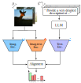

<h1 align="center">WildIng: A Wildlife Invariant Representation Model for Geographical Domain Shift</h1>
<h2 align="center">This work builds upon our previous research, presented as an <strong>Oral Presentation at WACV 2025</strong>.</h2>
<p align="center">
  
</p>
<p align="center">
<b>Authors:</b> Julian D. Santamaria<sup>1,2</sup>, Claudia Isaza<sup>1</sup>, Jhony H. Giraldo<sup>2</sup><br>
<sup>1</sup>SISTEMIC, Faculty of Engineering, Universidad de Antioquia-UdeA, Medellín, Colombia.<br>
<sup>2</sup>LTCI, Télécom Paris, Institut Polytechnique de Paris, Palaiseau, France.
</p>

## 📢 Announcement 
This work builds upon our previous research, presented as an **Oral Presentation at WACV 2025**
([WACV Paper](https://openaccess.thecvf.com/content/WACV2025/papers/Santamaria_CATALOG_A_Camera_Trap_Language-Guided_Contrastive_Learning_Model_WACV_2025_paper.pdf)).

The original model, **Camera Trap Language-Guided Contrastive Learning (CATALOG)**, was introduced in that study.
This repository extends that work with improved representations and new evaluations.

---

## Abstract

Wildlife monitoring is crucial for studying biodiversity loss and climate change. Camera trap images provide a non-intrusive method to track animal populations and analyze ecological patterns over time, enabling large-scale data collection for conservation research. However, manual analysis is time-consuming and resource-intensive. Deep learning, particularly foundation models, has been applied to automate wildlife identification, achieving strong performance when tested on data from the same geographical locations as their training sets. 
Yet, despite their promise, these models struggle to generalize to new geographical areas, leading to significant performance drops.
To address this, we introduce \method, a **Wild**life image **In**variant representation model for **g**eographical domain shift. WildIng integrates text descriptions with image features, creating a more robust representation to geographical domain shifts.
---

## Repository Overview

The repository is organized as follows:
- **`data/`**: Folder to store the datasets to be tested.
- **`feature_extraction/`**: Scripts for offline feature extraction for different model versions.
- **`features/`**: Folder to store the extracted features used for training and testing.
- **`models/`**: Pre-trained models and architecture definitions.
- **`train/`**: Training scripts for different model configurations.
- **`main.py`**: Central script to run training and testing with command-line arguments.
- **`ImageDescriptionExtractor.py`**: Script to extract the descriptions of the images

---

## Table of Contents
- [Installation](#installation)
- [Feature Extraction](#feature-extraction)
- [Training Models](#training-models)
- [Testing Models](#testing-models)
- [Available Models](#available-models)
- [Command-Line Arguments](#command-line-arguments)
- [Replicating Results](#replicating-results)
- [Acknowledgments](#acknowledgments)

---
## Installation
Clone this repository:
```bash
git clone -b WildIng https://github.com/Julian075/CATALOG.git
```
Create a conda environment

```bash
conda create -n CATALOG python=3.8.19 -y
conda activate CATALOG
```

Install the required Python libraries:
```bash
pip install torch==1.12.1+cu116 torchvision==0.13.1+cu116 torchaudio==0.12.1+cu116 --index-url https://download.pytorch.org/whl/cu116
```
```bash
pip install -r requirements.txt
```
---
## Usage

<p><b>Note:</b> Ensure the dataset is organized with a standardized structure: an <code>img/</code> directory containing the image files and a <code>descriptions/</code> directory containing the corresponding textual descriptions generated by the Vision-Language Model (VLM). Both directories should include subfolders named <code>Train/</code>, <code>Test/</code>, and <code>Val/</code> to separate the data into training, testing, and validation sets.</p>

### Description Extraction

Before extracting features, generate textual descriptions for your images using the ImageDescriptionExtractor.py script. This step prepares the descriptions required for multimodal learning.

Example:
```bash
python ImageDescriptionExtractor.py --path /data/<dataset_name>/img/train --dataset <dataset_name> --time 1
```

Descriptions will be saved in `data/<dataset_name>/descriptions/`.

### Feature Extraction
Before training or testing, make sure to extract the required features. You can find the corresponding script for each dataset, model, and training type in the feature_extraction/ folder. Execute the appropriate script to perform the feature extraction:

Example:
```bash
python feature_extraction/Base/CATALOG_extraction_features_Terra.py
```
The extracted features will be saved in the path: `features/Features_{dataset}/standard_features/Text_{mode_clip_i}.pt.` Features will always be extracted for mode_clip_i using the `ViT-B/32` and `ViT-B/16` versions.


---

## Training Models
To train a model, use the following command:
```bash
python main.py --model_version <Model_Type> --train_type <Training_Type> --dataset <Dataset> --mode train
```
### Example: In-domain Training
```bash
python main.py --model_version Base --train_type In_domain --dataset serengeti --mode train
```
### Example: Out-of-domain Training
```bash
python main.py --model_version Base --train_type Out_domain --dataset serengeti --dataset2 terra --mode train
```
---
## Testing Models
To test a trained model:
```bash
python main.py --model_version <Model_Type> --train_type <Training_Type> --dataset <Dataset> --mode test
```
### Example: Out-of-domain Testing
```bash
python main.py --model_version Fine_tuning --train_type Out_domain --dataset terra --mode test
```
---

## Available Models
The following models are available for training and evaluation:

| Model Type            | Description |
|----------------------|-------------|
| `Base_long`          | Standard WildIng model |
| `Fine_tuning`        | Fine-tuned WildIng model |
| `CLIP_Adapter`       | CLIP Adapter |
| `Long_CLIP_Adapter`  | Long CLIP Adapter |
| `BioCLIP_Adapter`    | BioCLIP Adapter |
| `Linear_Probe`       | Linear probe-based approach |
| `zero_shot_CLIP`     | Zero-shot CLIP model |
| `zero_shot_Long_CLIP`| Long zero-shot CLIP |
| `zero_shot_Bio`      | BioCLIP zero-shot model |

---

## Command-Line Arguments
| Argument              | Description                                         | Default         |
|----------------------|-----------------------------------------------------|-----------------|
| `--model_version`   | Specifies the model version (`Base_long`, `Fine_tuning`, etc.) | `"Fine_tuning"` |
| `--train_type`      | Specifies the type of training (`In_domain`, `Out_domain`) | `"In_domain"`   |
| `--dataset`         | Specifies the primary dataset (`serengeti`, `terra`) | `"serengeti"`   |
| `--dataset2`        | Specifies the secondary dataset for **Out-of-domain training** | `"terra"`       |
| `--mode`            | Specifies the mode (`train`, `test`)   | `"train"`       |
| `--hyperparameterTuning_mode` | Enables hyperparameter tuning (`0` for off, `1` for tuning, `2` for testing best model) | `0` |
| `--feature_extraction` | Enables feature extraction (`0` for off, `1` for on) | `0` |
| `--LLM`            | Defines the language model used | `"ChatGPT"` |
| `--beta`            | Defines the beta value for training | `1.0` |
| `--alpha`           | Defines the alpha value for training | `0.5` |
---

## Replicating Results
Ensure that:
1. Datasets are in the `data/` folder.
2. Features are precomputed in the `features/` folder.
3. The correct model version and training type are specified.

### Example Commands
#### In-domain Training (Serengeti)
```bash
python main.py --model_version Fine_tuning --train_type In_domain --dataset serengeti --mode train
```
#### Out-of-domain Training
```bash
python main.py --model_version Base_long --train_type Out_domain --dataset serengeti --dataset2 terra --mode train
---
```
@inproceedings{santamaria2025catalog,
  title={CATALOG: A Camera Trap Language-guided Contrastive Learning Model},
  author={Julian D. Santamaria, Claudia Isaza, Jhony H. Giraldo},
  booktitle={IEEE/CVF Winter Conference on Applications of Computer Vision},
  year={2025}
}
```
## Acknowledgment.
This work was supported by Universidad de Antioquia - CODI and Alexander von Humboldt Institute for Research on Biological Resources (project 2020-33250), and by the ANR (French National Research Agency) under the JCJC project DeSNAP (ANR-24-CE23-1895-01), and by the Academic Grant from NVIDIA AI.
