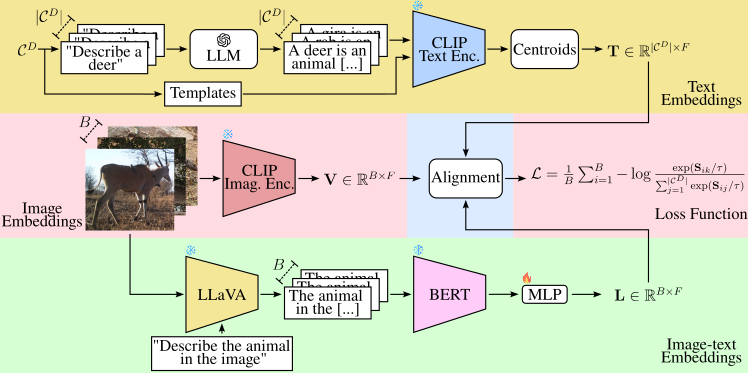

<h1 align="center">Camera Trap Language-guided Contrastive Learning (CATALOG)</h1>
<p align="center">
  
</p>

<p align="center">
This is the repository of the model "Camera Trap Language-guided Contrastive Learning (CATALOG)" accepted at <strong>WACV 2025</strong>.
</p>

<p align="center">
<b>Authors:</b> Julian D. Santamaria<sup>1</sup>, Claudia Isaza<sup>1</sup>, Jhony H. Giraldo<sup>2</sup><br>
<sup>1</sup>SISTEMIC, Faculty of Engineering, Universidad de Antioquia-UdeA, Medellín, Colombia.<br>
<sup>2</sup>LTCI, Télécom Paris, Institut Polytechnique de Paris, Palaiseau, France.
</p>


---

## Abstract

Foundation Models (FMs) have demonstrated significant success in computer vision tasks such as image classification, object detection, and image segmentation. However, domain shift remains a challenge, particularly in camera-trap image recognition due to factors like lighting, camouflage, and occlusions. CATALOG combines multi-modal fusion and contrastive learning to address these issues. It has been evaluated on **Snapshot Serengeti** and **Terra Incognita** datasets, showing state-of-the-art performance when training and testing data differ in animal species or environmental conditions.

---

## Repository Overview

The repository is organized as follows:
- **`data/`**: Folder to store the datasets to be tested.
- **`feature_extraction/`**: Scripts for offline feature extraction for different model versions.
- **`features/`**: Folder to store the extracted features used for training and testing.
- **`models/`**: Pre-trained models and architecture definitions.
- **`train/`**: Training scripts for different model configurations.
- **`main.py`**: Central script to run training and testing with command-line arguments.

Clone this repository:
```bash
git clone https://github.com/Julian075/CATALOG.git
```

Install the required Python libraries:
```bash
pip install -r requirements.txt
```
---
## Usage

### Feature Extraction
Before training or testing, make sure to extract the required features. You can find the corresponding script for each dataset, model, and training type in the feature_extraction/ folder. Execute the appropriate script to perform the feature extraction:

Example:
```bash
python feature_extraction/Base/CATALOG_extraction_features_Terra.py
```
The extracted features will be saved in the path: `features/Features_{dataset}/standard_features/Text_{mode_clip_i}.pt.` Features will always be extracted for mode_clip_i using the `ViT-B/32` and `ViT-B/16` versions.


### Training a Model

To train a specific model, use:
```bash
python main.py --model_version <Model_Type> --train_type <Training_Type> --dataset <Dataset> --mode train
```
Example:
```bash
python main.py --model_version Base --train_type In_domain --dataset serengeti --mode train
```
### Testing a Model
To test a trained model, use:
```bash
python main.py --model_version <Model_Type> --train_type <Training_Type> --dataset <Dataset> --mode test
```
Example:
```bash
python main.py --model_version Fine_tuning --train_type Out_domain --dataset terra --mode test
```
### Default Feature and Model Parameter Paths

For each type of model, the following default paths are set for feature files and model parameters:

- **Feature Paths** (for training, validation, testing, and textual features):
  - `ruta_features_train`: `features/Features_serengeti/finetuning_features/Features_CATALOG_train_16.pt`
  - `ruta_features_val`: `features/Features_serengeti/finetuning_features/Features_CATALOG_val_16.pt`
  - `ruta_features_test`: `features/Features_serengeti/finetuning_features/Features_CATALOG_test_16.pt`
  - `path_text_feat`: `features/Features_serengeti/finetuning_features/Text_features_16.pt`

- **Model Parameters Path** (used for testing):
  - `model_params_path`: `models/CATALOG_finetuning_layer_Base_Serengeti.pth`

These paths are required for testing and can be customized as needed by modifying the respective arguments in `main.py`.
### Command-Line Arguments
Command-Line Arguments:
| Argument         | Description                                         | Default         |
|------------------|-----------------------------------------------------|-----------------|
| `--model_version` | Specifies the model version (`Base`, `Fine_tuning`, `Fine_tuning_layer`, `Base_long`.) | `"Fine_tuning"` |
| `--train_type`   | Specifies the type of training (`In_domain`, `Out_domain`) | `"In_domain"`   |
| `--dataset`      | Specifies the dataset to use (`serengeti`, `terra`) | `"serengeti"`   |
| `--mode`         | Specifies the mode (`train`, `test`, `test_top3`)   | `"train"`       |
---
## Replicate Results
To replicate results, ensure that the datasets are placed in the `data/` folder and features are precomputed in the `features/` folder.

Example Commands:
For **Snapshot Serengeti** (In-domain training):
```bash
python main.py --model_version Base --train_type In_domain --dataset serengeti --mode train
```
For **Terra Incognita** (Out-domain training):
```bash
python main.py --model_version Fine_tuning --train_type Out_domain --dataset terra --mode train
```
<p><b>Note:</b> Ensure the dataset follows the required structure: an <code>img/</code> folder containing images and a <code>descriptions/</code> folder containing the output descriptions from the VLM. Within each of these, the subfolders should be organized as <code>Train/</code>, <code>Test/</code>, and <code>Val/</code>.</p>

If you use this code, please cite our work:
```
@inproceedings{santamaria2025catalog,
  title={Camera Trap Language-guided Contrastive Learning (CATALOG)},
  author={Julian D. Santamaria, Claudia Isaza, Jhony H. Giraldo},
  booktitle={WACV},
  year={2025}
}
```
## Acknowledgment.
This work was supported by Universidad de Antioquia - CODI and Alexander von Humboldt Institute for Research on Biological Resources. [code project: 2020-33250].
