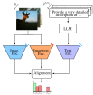

<h1 align="center">WildIng: A Wildlife Invariant Representation Model for Geographical Domain Shift</h1>
<h2 align="center">This work builds upon our previous research, presented as an <strong>Oral Presentation at WACV 2025</strong>.</h2>
<p align="center">
  
</p>
<p align="center">
<b>Authors:</b> Julian D. Santamaria<sup>1,2</sup>, Claudia Isaza<sup>1</sup>, Jhony H. Giraldo<sup>2</sup><br>
<sup>1</sup>SISTEMIC, Faculty of Engineering, Universidad de Antioquia-UdeA, Medellín, Colombia.<br>
<sup>2</sup>LTCI, Télécom Paris, Institut Polytechnique de Paris, Palaiseau, France.
</p>

## 📢 Announcement 
This work builds upon our previous research, presented as an **Oral Presentation at WACV 2025**
([WACV Paper](https://openaccess.thecvf.com/content/WACV2025/papers/Santamaria_CATALOG_A_Camera_Trap_Language-Guided_Contrastive_Learning_Model_WACV_2025_paper.pdf)).

The original model, **Camera Trap Language-Guided Contrastive Learning (CATALOG)**, was introduced in that study.
This repository extends that work with improved representations and new evaluations.

## Abstract
Wildlife monitoring is crucial for studying biodiversity loss and climate change. Camera trap images provide a non-intrusive method to track animal populations and analyze ecological patterns over time, enabling large-scale data collection for conservation research. However, manual analysis is time-consuming and resource-intensive. Deep learning, particularly foundation models, has been applied to automate wildlife identification, achieving strong performance when tested on data from the same geographical locations as their training sets. 
Yet, despite their promise, these models struggle to generalize to new geographical areas, leading to significant performance drops.
To address this, we introduce **WildIng**, a **Wild**life image **In**variant representation model for **g**eographical domain shift. WildIng integrates text descriptions with image features, creating a more robust representation to geographical domain shifts.

## Repository Overview

The repository is organized as follows:
- **`data/`**: Folder to store the datasets to be tested.
- **`feature_extraction/`**: Scripts for offline feature extraction for different model versions.
- **`features/`**: Folder to store the extracted features used for training and testing.
- **`models/`**: Pre-trained models and architecture definitions.
- **`train/`**: Training scripts for different model configurations.
- **`main.py`**: Central script to run training and testing with command-line arguments.
- **`ImageDescriptionExtractor.py`**: Script to extract the descriptions of the images

---

## Table of Contents
- [Installation](#installation)
- [Feature Extraction](#feature-extraction)
- [Training Models](#training-models)
- [Testing Models](#testing-models)
- [Available Models](#available-models)
- [Command-Line Arguments](#command-line-arguments)
- [Replicating Results](#replicating-results)
- [Acknowledgments](#acknowledgments)

---
## Installation
Clone this repository:
```bash
git clone -b WildIng https://github.com/Julian075/CATALOG.git
```
Create a conda environment

```bash
conda create -n CATALOG python=3.8.19 -y
conda activate CATALOG
```

Install the required Python libraries:
```bash
pip install torch==1.12.1+cu116 torchvision==0.13.1+cu116 torchaudio==0.12.1+cu116 --index-url https://download.pytorch.org/whl/cu116
```
```bash
pip install -r requirements.txt
```
---


## Checkpoints
You can temporarily access the checkpoints at the following link: https://drive.google.com/drive/folders/1cU9uD6q_B_4rjEd_0TdhH-KE_IpYmiTz?usp=sharing

## Model Architecture

### Core Models
- **WildIng (Base_long)**: The main model that integrates text descriptions with image features for robust geographical domain adaptation
- **CATALOG Base**: The original model architecture with standard feature extraction
- **Fine-tuned Models**: Domain-specific adaptations of the base model

### Model Variants
- **CLIP-based Models**:
  - `CLIP_Adapter`: Uses CLIP features with adapter layers
  - `Long_CLIP_Adapter`: Extended CLIP features with adapter layers
  - `BioCLIP_Adapter`: Specialized for biological features
- **Zero-shot Models**:
  - `zero_shot_CLIP`: Direct CLIP predictions
  - `zero_shot_Long_CLIP`: Extended CLIP predictions
  - `zero_shot_Bio`: BioCLIP predictions
- **Linear Probe**: Simple linear classifier approach

## Dataset Structure

### Required Directory Structure
```
data/
├── <dataset_name>/
│   ├── img/
│   │   ├── Train/
│   │   ├── Test/
│   │   └── Val/
│   └── descriptions/
│       ├── Train/
│       ├── Test/
│       └── Val/
```

### Dataset Splits
- **Standard Splits**: Train/Val/Test
- **Terra Dataset Splits**: 
  - Cis-test: Same geographical region
  - Trans-test: Different geographical region

## Feature Extraction

### Prerequisites
1. Ensure your dataset follows the required structure (see Dataset Structure section)
2. Generate image descriptions using the ImageDescriptionExtractor:
```bash
python ImageDescriptionExtractor.py --path /data/<dataset_name>/img --dataset <dataset_name> --time 1
```

The ImageDescriptionExtractor uses LLaVA-1.5-7B to generate detailed descriptions of animal species. It:
- Processes images in batches across train/test/val splits
- Generates detailed descriptions focusing on visible features
- Saves descriptions as JSON files in the descriptions directory
- Supports GPU acceleration for faster processing
- Includes memory management for large datasets

### Running Feature Extraction
Run feature extraction using main.py:
```bash
python main.py --model_version <Model_Type> --dataset <Dataset> --feature_extraction 1 --LLM <LLM_Type> --beta <beta_value>
```

### Feature Types and Models
The feature extraction process supports different model variants:

- **Base Models**:
  - `Base`: Standard CLIP features (ViT-B/16)
  - `Base_long`: LongCLIP features
  - `Fine_tuning`: Fine-tuned features

- **CLIP Variants**:
  - Standard CLIP (ViT-B/16)
  - LongCLIP
  - BioCLIP

### Output Structure
Extracted features are saved in the following structure:
```
features/
├── Features_{dataset}/
│   ├── standard_features/
│   │   ├── Features_{dataset}.pt
│   │   └── Prompts_{dataset}_{LLM}_{beta}.pt
│   ├── long_features/
│   │   ├── Features_{dataset}.pt
│   │   └── Prompts_{dataset}_{LLM}_{beta}.pt
│   └── finetuning_features/
       ├── Features_{dataset}.pt
       └── Prompts_{dataset}_{LLM}_{beta}.pt
```

## Training and Evaluation

### Training Modes
- **In-domain Training**:
  - Trains models on data from a single geographical location
  - Used for baseline performance evaluation
  - Command: `--train_type In_domain`

- **Out-of-domain Training**:
  - Trains models to handle geographical domain shifts
  - Uses two datasets: source and target domains
  - Command: `--train_type Out_domain --dataset <source> --dataset2 <target>`

### Hyperparameter Tuning
- **Available Parameters**:
  - `--alpha`: Weight for CLIP features (default: 0.5)
  - `--beta`: Language model parameter (default: 1.0)
  - `--sup_loss`: Enable attention layer (0/1)

- **Tuning Process**:
  1. Random Search: `--hyperparameterTuning_mode 1`
     - Performs 30 random combinations
     - Uses validation seeds for evaluation
  2. Best Model Testing: `--hyperparameterTuning_mode 2`
     - Tests the best configuration
     - Uses test seeds for final evaluation

## Command-Line Arguments
| Argument              | Description                                         | Default         |
|----------------------|-----------------------------------------------------|-----------------|
| `--model_version`   | Specifies the model version (`Base_long`, `Fine_tuning`, etc.) | `"Fine_tuning"` |
| `--train_type`      | Specifies the type of training (`In_domain`, `Out_domain`) | `"In_domain"`   |
| `--dataset`         | Specifies the primary dataset (`serengeti`, `terra`) | `"serengeti"`   |
| `--dataset2`        | Specifies the secondary dataset for **Out-of-domain training** | `"terra"`       |
| `--mode`            | Specifies the mode (`train`, `test`)   | `"train"`       |
| `--hyperparameterTuning_mode` | Enables hyperparameter tuning (`0` for off, `1` for tuning, `2` for testing best model) | `0` |
| `--feature_extraction` | Enables feature extraction (`0` for off, `1` for on) | `0` |
| `--LLM`            | Defines the language model used | `"ChatGPT"` |
| `--beta`            | Defines the beta value for training | `1.0` |
| `--alpha`           | Defines the alpha value for training | `0.5` |

## Training Models
To train a model, use the following command:
```bash
python main.py --model_version <Model_Type> --train_type <Training_Type> --dataset <Dataset> --mode train
```
### Example: In-domain Training
```bash
python main.py --model_version Base --train_type In_domain --dataset serengeti --mode train
```
### Example: Out-of-domain Training
```bash
python main.py --model_version Base --train_type Out_domain --dataset serengeti --dataset2 terra --mode train
```
---
## Testing Models
To test a trained model:
```bash
python main.py --model_version <Model_Type> --train_type <Training_Type> --dataset <Dataset> --mode test
```
### Example: Out-of-domain Testing
```bash
python main.py --model_version Fine_tuning --train_type Out_domain --dataset terra --mode test
```
---

## Available Models
The following models are available for training and evaluation:

| Model Type            | Description |
|----------------------|-------------|
| `Base_long`          | Standard WildIng model |
| `Fine_tuning`        | Fine-tuned WildIng model |
| `CLIP_Adapter`       | CLIP Adapter |
| `Long_CLIP_Adapter`  | Long CLIP Adapter |
| `BioCLIP_Adapter`    | BioCLIP Adapter |
| `Linear_Probe`       | Linear probe-based approach |
| `zero_shot_CLIP`     | Zero-shot CLIP model |
| `zero_shot_Long_CLIP`| Long zero-shot CLIP |
| `zero_shot_Bio`      | BioCLIP zero-shot model |

---

## Replicating Results
Ensure that:
1. Datasets are in the `data/` folder.
2. Features are precomputed in the `features/` folder.
3. The correct model version and training type are specified.

### Example Commands
#### In-domain Training (Serengeti)
```bash
python main.py --model_version Fine_tuning --train_type In_domain --dataset serengeti --mode train
```
#### Out-of-domain Training
```bash
python main.py --model_version Base_long --train_type Out_domain --dataset serengeti --dataset2 terra --mode train
---
```
If you use this code, please cite our work:
```
@InProceedings{Santamaria_2025_WACV,
    author    = {Santamaria, Julian D. and Isaza, Claudia and Giraldo, Jhony H.},
    title     = {CATALOG: A Camera Trap Language-Guided Contrastive Learning Model},
    booktitle = {Proceedings of the Winter Conference on Applications of Computer Vision (WACV)},
    month     = {February},
    year      = {2025},
    pages     = {1197-1206}
}
```
## Acknowledgment.
This work was supported by Universidad de Antioquia - CODI and Alexander von Humboldt Institute for Research on Biological Resources (project 2020-33250), and by the ANR (French National Research Agency) under the JCJC project DeSNAP (ANR-24-CE23-1895-01), and by the Academic Grant from NVIDIA AI.

